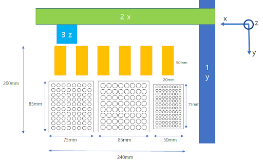
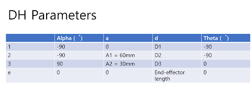
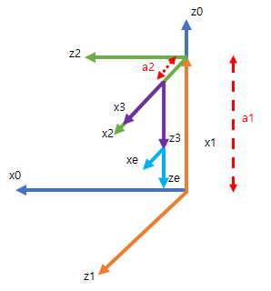

# Proteus Robotic Lab Automation

* Idea on Proteus X-Y Plane as Top-view - IT IS JUST INTUITION from YOUTUBE CLIP about PROTEUS

* DH Parameters

* Coordinates for Forward Kinematics

    * Homogeneous Transformation Matrix

        HT from base to end effector

            = [0, 1, 0,            d2]

              [1, 0, 0,       a2 + d1]
              
              [0, 0, -1, a1 - d3 - d4]
              
              [0, 0, 0,             1]