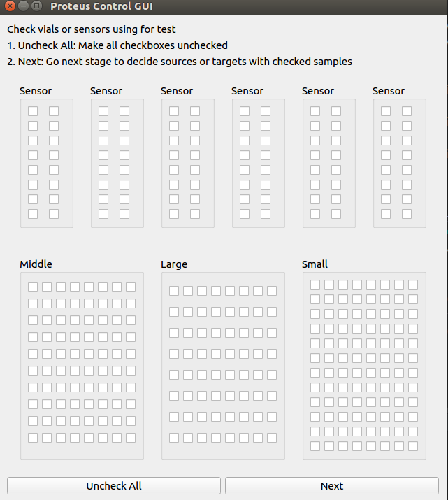
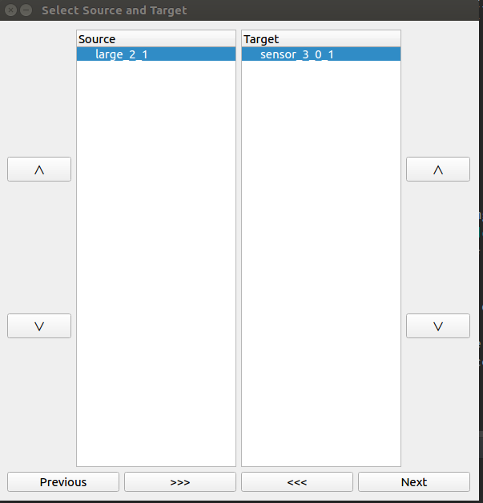
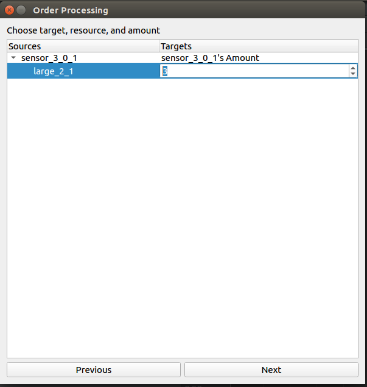
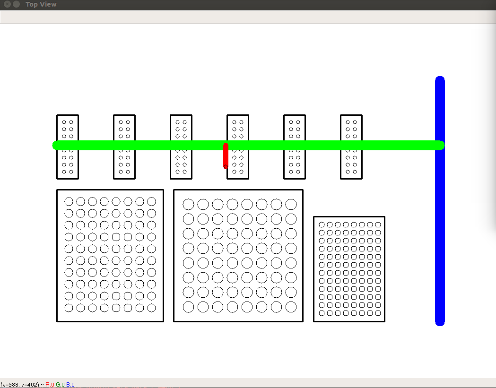
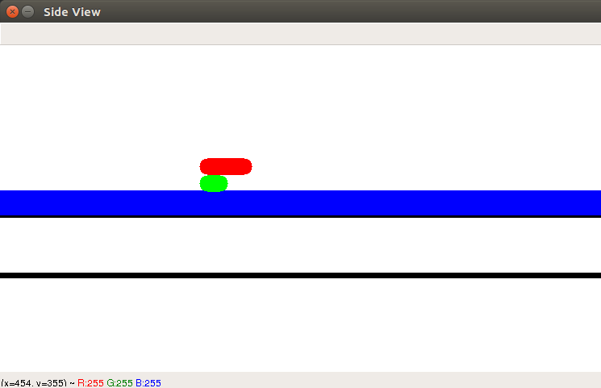

# Proteus Robotic Lab Automation

* Idea on Proteus X-Y Plane as Top-view - IT IS JUST INTUITION from YOUTUBE CLIP about PROTEUS

* DH Parameters

* Coordinates for Forward Kinematics

    * Homogeneous Transformation Matrix

        HT from base to end effector

            = [0, 1, 0,            d2]

              [1, 0, 0,       a2 + d1]
              
              [0, 0, -1, a1 - d3 - d4]
              
              [0, 0, 0,             1]
              
* Inverse Kinematics
    * x = d2
    * y = a2 + d1
    * z = a1 - d3 - d4
    * d1 - joint 1, d2 - joint 2, d3 - joint 3, d4 - end-effector length
    
* GUI1: Choose Samples for Test

* GUI2: Select Source and Target from Checked Samples

* GUI3: Select Targeted Amount for Testing 

* Simulation 1: Top View of Workspace 

* Simulation 2: Side View of Workspace 

